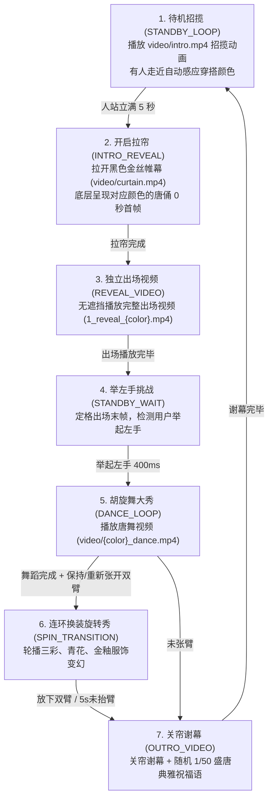

# 💃 乐舞胡旋 (Hu Xuan Dance)

> **数字化非遗互动装置** | 多模态穿搭感应 · 实时动作捕捉 · 盛唐三彩乐舞

《乐舞胡旋》是一个结合 **AI 穿搭色彩感应** 与 **MediaPipe 实时动作捕捉** 的数字化非遗展项原型。体验者通过自身的今日穿搭（OOTD）唤醒相匹配的大唐三彩乐俑（红、蓝、黑、白、灰五大经典釉色），并通过简单的肢体动作（举左手、张双臂）开启大唐胡旋舞与釉色换装大秀。

---

## 🎬 展项互动全流程 (Interactive Workflow)



---

## 🎨 五大盛唐三彩角色 (The 5 Color Figurines)

- 🔴 **反弹琵琶 · 绯红霓裳** (`red`) — 祝福语：鸿运当头，锦绣前程
- 🔵 **大唐拂袖 · 天青呈祥** (`blue`) — 祝福语：福寿绵长，皆得所愿
- 🖤 **仙人指路 · 水墨乐姬** (`black`) — 祝福语：万象更新，顺遂无忧
- ⚪ **执乐仕女 · 皎白霓裳** (`white`) — 祝福语：岁岁平安，吉庆有余
- 🩶 **执乐仕女 · 苍灰古韵** (`gray`) — 祝福语：吉祥如意，福泽绵长

---

## 🚀 快速开始 (Quick Start)

这是一个纯前端项目，无需复杂编译环境：

### 1. 本地网页服务 (Local Hosting)
在项目根目录下运行：

```bash
# 使用 Python3 启动静态服务器
python3 -m http.server 8000
```
在 Chrome 浏览器中访问：**`http://localhost:8000`**

### 2. 本地 AI 色彩识别（可选）
项目支持配合本地运行的 Ollama VLM (Moondream) 模型进行实时穿搭识别：

```bash
# 启动 Ollama 服务 (允许跨域)
OLLAMA_ORIGINS="*" OLLAMA_HOST="0.0.0.0" ./ollama serve

# 在另一个终端拉取轻量级 Moondream 视觉模型
./ollama pull moondream
```
*注：若未启动本地 AI 服务，前端将自动启用离线智能色彩匹配降级模式，不影响主流程体验。*

---

## 🛠️ 快捷调试 (Developer Cheatsheet)

- 🖱️ **手动点击触发**：在无摄像头的开发机上调试时，直接**用鼠标点击网页空白区域**即可手动步进跳过当前动作挑战，快速测试完整流程。
- 🔍 **查看祝福语库**：完整 50 首盛唐古风祝福语清单详见 [blessings_database.md](blessings_database.md)。

---

祝您大唐之旅愉快！
