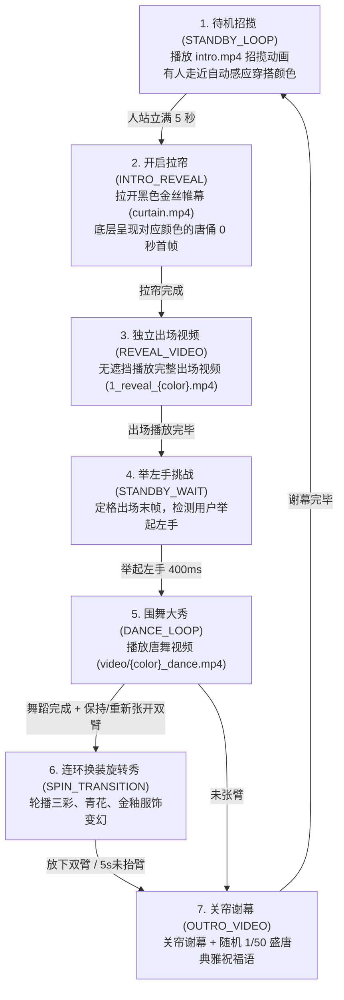

# 💃 乐舞胡旋 (Hu Xuan Dance & Tang Sancai 3D Avatar Flow)

> **数字化非遗互动装置** | 多模态 AI 穿搭感应 · MediaPipe 实时 3D 动作捕捉 · Three.js 骨骼重定向 · 盛唐三彩乐舞

[](https://opensource.org/licenses/MIT)
[](https://www.python.org/)
[](https://threejs.org/)
[](https://google.github.io/mediapipe/)

《乐舞胡旋》是一个结合 **Gemini 多模态视觉 AI**、**MediaPipe 实时 3D 姿态捕捉** 与 **Three.js 3D 骨骼重定向** 的数字化非遗展项原型。体验者可以通过上传视频或使用摄像头进行穿搭与动作捕捉，唤醒相匹配的大唐三彩乐俑（红、蓝、黑、白、灰五大经典釉色），驱动 3D 唐俑实时演绎盛唐胡旋舞，并导出高画质渲染视频。

---

## 🎬 Demo 演示 (Demo Video)

<!-- 
💡 提示：上传视频到 GitHub README 的方法：
将 .mp4 拖拽到 GitHub 的 Issue 或 README 编辑窗口中，上传后粘贴自动生成的 HTML 标签到下方：
-->

<div align="center">
  
  <p><em>▲ 乐舞胡旋：AI 穿搭感应与 3D 动作捕捉交互演示</em></p>
</div>

---

## ✨ 核心特性 (Key Features)

1. **🎨 智能穿搭感应与唐俑匹配**：
   - 支持通过 **Gemini 2.5 Flash** 多模态视觉大模型分析体验者的姿态、色彩与气质，智能匹配盛唐三彩乐俑（优雅仕女、刚劲武士、乐舞胡人等）。
   - 内置优雅的离线 Mock 匹配降级机制，无 API Key 也可流畅运行。
2. **🕺 实时 3D 动作捕捉 (MediaPipe Pose)**：
   - 基于 MediaPipe Pose Landmarker 实时提取 33 个 3D 身体骨骼关键点（含深度 Z 轴）。
3. **🎭 3D 骨骼重定向 (Three.js Retargeting)**：
   - 将人体 3D Landmark 算法重定向至 rigged 3D avatar (GLTF/GLB) 骨骼网格上，实现低延迟动作驱动。
4. **📹 混合渲染与视频导出 (Canvas Recorder)**：
   - 使用 Web Canvas Capture API 与 MediaRecorder 实时录制合成视频，支持导出 MP4 / WebM 高清视频。

---

## 🎬 展项互动全流程 (Interactive Workflow)



---

## 🎨 五大盛唐三彩角色 (The 5 Color Figurines)

- 🔴 **反弹琵琶 · 绯红霓裳** (`red`) — 祝福语：鸿运当头，锦绣前程
- 🔵 **大唐拂袖 · 天青呈祥** (`blue`) — 祝福语：福寿绵长，皆得所愿
- 🖤 **仙人指路 · 水墨乐姬** (`black`) — 祝福语：万象更新，顺遂无忧
- ⚪ **执乐仕女 · 皎白霓裳** (`white`) — 祝福语：岁岁平安，吉庆有余
- 🩶 **执乐仕女 · 苍灰古韵** (`gray`) — 祝福语：吉祥如意，福泽绵长

---

## 🚀 快速开始 (Quick Start)

### 环境要求
- **浏览器**：Chrome / Edge / Safari / Firefox (必须支持 WebGL & ES6 Modules)
- **Python 环境**：Python 3.8+ (可选，使用完整 Flask 服务时需要)

---

### 方式 1：使用 Python Flask 服务 (推荐，包含 AI 接口)

1. **安装依赖**：
   ```bash
   pip install flask google-genai
   ```

2. **配置 Gemini API Key（可选）**：
   ```bash
   export GEMINI_API_KEY="your-api-key-here"
   ```
   *注：若未配置 API Key，系统将自动进入 Mock 模式，不影响 3D 姿态捕捉与交互体验。*

3. **启动服务器**：
   ```bash
   python server.py
   ```

4. **访问应用**：
   在浏览器中打开 **`http://127.0.0.1:8080`**。

---

### 方式 2：纯静态 HTTP 服务器启动 (零依赖)

如果只需测试前端动捕与 3D 渲染，可以直接启动静态服务器：

```bash
# 在项目根目录下运行
python3 -m http.server 8000
```
在浏览器中打开：**`http://localhost:8000/static/`**

> ⚠️ **注意**：由于浏览器安全性限制（ES6 Modules CORS 策略），请勿直接通过双击 `file://` 打开 `index.html`，必须通过 HTTP 服务器访问。

---

## 📂 目录结构 (Directory Structure)

```text
├── server.py              # Flask 后端服务 (静态文件托管 + Gemini AI 识别 API)
├── package.json           # 项目前端依赖与配置
├── BUILD                  # Blaze / Bazel 构建文件
├── README.md              # 项目说明文档
└── static/                # 前端资源目录
    ├── index.html         # 主界面 HTML
    ├── app.js             # 主程序逻辑与状态机控制
    ├── pose.js            # MediaPipe Pose Landmarker 封装
    ├── three_scene.js     # Three.js 3D 场景、模型加载与骨骼重定向驱动
    ├── motion_capture.js  # 肢体动作识别与挑战判定
    ├── recorder.js        # Canvas 视频录制与导出
    ├── models/            # 3D 模型资产 (sancai_lady.glb, sancai_warrior.glb 等)
    └── assets/            # 材质贴图与音频资源
```

---

## 🛠️ 调试 CheatSheet

- 🖱️ **手动跳过/步进**：在无摄像头的开发环境下，可以直接**点击网页空白区域**手动触发步进，快速测试完整交互流程。
- 🔍 **祝福语数据库**：完整 50 首盛唐古风祝福语见 `blessings_database.md`。

---

## 📜 开源许可 (License)

[MIT License](LICENSE)
